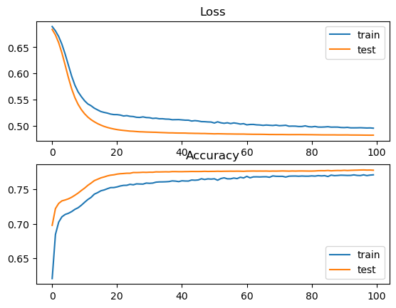

```python
import pandas as pd###数据处理和分析
import sklearn.metrics as metrique###提供了多种评估机器学习模型性能的指标
from pandas import Series###pandas库中的一个重要数据结构，表示一维的标记数组
from sklearn.preprocessing import StandardScaler, MinMaxScaler###pandas库中的一个重要数据结构，表示一维的标记数组
from matplotlib import pyplot
from sklearn.model_selection import train_test_split
import numpy as np
from keras.callbacks import EarlyStopping###keras.callbacks 模块中的工具，用于在训练神经网络时执行回调操作，如提前停止训练或保存模型
#from keras.utils import np_utils
from tensorflow.python.keras.utils.np_utils import to_categorical

from keras.callbacks import ModelCheckpoint
from sklearn.metrics import accuracy_score
from sklearn.metrics import classification_report, confusion_matrix
from keras.models import Sequential
#from keras.utils import np_utils
from keras.layers import LSTM, Dense, Embedding, Dropout,Input, Attention, Layer, Concatenate, Permute, Dot, Multiply, Flatten###keras.layers 中的层，用于构建神经网络的各个部分
from keras.layers import RepeatVector, Dense, Activation, Lambda
from keras.models import Sequential
from keras import backend as K, regularizers, Model, metrics
from keras.backend import cast
```


```python
data = pd.read_csv('final_feature_all.csv', na_filter=True)
col_del=['all_opnum_1','all_opnum_2','all_opnum_3','all_opnum_4','all_opnum_5','all_opnum_6','all_opnum_7','all_opnum_8','all_opnum_9','all_opnum_10','all_opnum_11','all_opnum_13','all_opnum_14','all_opnum_15','all_opnum_17','all_opnum_21','all_opnum_27',
        'valid_opnum_1','valid_opnum_4','valid_opnum_6','valid_opnum_7','valid_opnum_12','valid_opnum_13','valid_opnum_17','valid_opnum_18','valid_opnum_20','valid_opnum_21','valid_opnum_22','valid_opnum_23','valid_opnum_24','valid_opnum_26','valid_opnum_27','valid_opnum_28','valid_opnum_30',
        'last_minutes_1','last_minutes_2','last_minutes_3','last_minutes_4','last_minutes_5','last_minutes_6','last_minutes_7','last_minutes_8','last_minutes_9','last_minutes_10','last_minutes_11','last_minutes_12','last_minutes_13','last_minutes_14','last_minutes_15','last_minutes_16','last_minutes_17','last_minutes_18','last_minutes_19','last_minutes_20','last_minutes_21','last_minutes_22','last_minutes_23','last_minutes_24','last_minutes_25','last_minutes_26','last_minutes_27','last_minutes_28','last_minutes_29','last_minutes_30',
        'pre_min','pre_max','pre_sum','pre_mean','pre_std','mid_min','mid_max','mid_sum','mid_mean','mid_std','last_min','last_max','last_sum','last_mean','last_std','thirty_day_min','thirty_day_max','thirty_day_sum','thirty_day_mean','thirty_day_std',
        'username','course_id','course_num','nondropout_num','nondropout_num','nondrop_precent','enrollment_id']###从data DataFrame中删除的列的名称
data.head(10)
```


<div>
<style scoped>
    .dataframe tbody tr th:only-of-type {
        vertical-align: middle;
    }

    .dataframe tbody tr th {
        vertical-align: top;
    }

    .dataframe thead th {
        text-align: right;
    }
</style>
<table border="1" class="dataframe">
  <thead>
    <tr style="text-align: right;">
      <th></th>
      <th>enrollment_id</th>
      <th>all_opnum_1</th>
      <th>all_opnum_2</th>
      <th>all_opnum_3</th>
      <th>all_opnum_4</th>
      <th>all_opnum_5</th>
      <th>all_opnum_6</th>
      <th>all_opnum_7</th>
      <th>all_opnum_8</th>
      <th>all_opnum_9</th>
      <th>...</th>
      <th>thirty_day_max</th>
      <th>thirty_day_sum</th>
      <th>thirty_day_mean</th>
      <th>thirty_day_std</th>
      <th>username</th>
      <th>course_id</th>
      <th>course_num</th>
      <th>nondropout_num</th>
      <th>nondrop_precent</th>
      <th>dropout</th>
    </tr>
  </thead>
  <tbody>
    <tr>
      <th>0</th>
      <td>1</td>
      <td>0</td>
      <td>0</td>
      <td>13</td>
      <td>0</td>
      <td>0</td>
      <td>0</td>
      <td>0</td>
      <td>24</td>
      <td>0</td>
      <td>...</td>
      <td>67</td>
      <td>314</td>
      <td>10</td>
      <td>18.70</td>
      <td>0</td>
      <td>28</td>
      <td>6</td>
      <td>4.0</td>
      <td>0.666667</td>
      <td>0</td>
    </tr>
    <tr>
      <th>1</th>
      <td>3</td>
      <td>28</td>
      <td>0</td>
      <td>0</td>
      <td>0</td>
      <td>3</td>
      <td>0</td>
      <td>0</td>
      <td>30</td>
      <td>0</td>
      <td>...</td>
      <td>64</td>
      <td>288</td>
      <td>9</td>
      <td>18.36</td>
      <td>1</td>
      <td>9</td>
      <td>3</td>
      <td>3.0</td>
      <td>1.000000</td>
      <td>0</td>
    </tr>
    <tr>
      <th>2</th>
      <td>4</td>
      <td>0</td>
      <td>0</td>
      <td>0</td>
      <td>20</td>
      <td>11</td>
      <td>0</td>
      <td>0</td>
      <td>0</td>
      <td>0</td>
      <td>...</td>
      <td>20</td>
      <td>99</td>
      <td>3</td>
      <td>5.89</td>
      <td>2</td>
      <td>28</td>
      <td>2</td>
      <td>1.0</td>
      <td>0.500000</td>
      <td>0</td>
    </tr>
    <tr>
      <th>3</th>
      <td>5</td>
      <td>2</td>
      <td>0</td>
      <td>145</td>
      <td>0</td>
      <td>0</td>
      <td>0</td>
      <td>0</td>
      <td>0</td>
      <td>0</td>
      <td>...</td>
      <td>145</td>
      <td>633</td>
      <td>21</td>
      <td>40.73</td>
      <td>3</td>
      <td>9</td>
      <td>1</td>
      <td>1.0</td>
      <td>1.000000</td>
      <td>0</td>
    </tr>
    <tr>
      <th>4</th>
      <td>6</td>
      <td>0</td>
      <td>0</td>
      <td>0</td>
      <td>0</td>
      <td>0</td>
      <td>0</td>
      <td>0</td>
      <td>0</td>
      <td>0</td>
      <td>...</td>
      <td>17</td>
      <td>23</td>
      <td>0</td>
      <td>3.20</td>
      <td>4</td>
      <td>22</td>
      <td>1</td>
      <td>1.0</td>
      <td>1.000000</td>
      <td>0</td>
    </tr>
    <tr>
      <th>5</th>
      <td>7</td>
      <td>20</td>
      <td>0</td>
      <td>125</td>
      <td>0</td>
      <td>0</td>
      <td>0</td>
      <td>0</td>
      <td>0</td>
      <td>0</td>
      <td>...</td>
      <td>125</td>
      <td>479</td>
      <td>15</td>
      <td>31.32</td>
      <td>5</td>
      <td>9</td>
      <td>4</td>
      <td>0.0</td>
      <td>0.000000</td>
      <td>1</td>
    </tr>
    <tr>
      <th>6</th>
      <td>9</td>
      <td>0</td>
      <td>0</td>
      <td>0</td>
      <td>0</td>
      <td>0</td>
      <td>0</td>
      <td>0</td>
      <td>0</td>
      <td>0</td>
      <td>...</td>
      <td>28</td>
      <td>97</td>
      <td>3</td>
      <td>7.42</td>
      <td>6</td>
      <td>28</td>
      <td>2</td>
      <td>1.0</td>
      <td>0.500000</td>
      <td>1</td>
    </tr>
    <tr>
      <th>7</th>
      <td>12</td>
      <td>0</td>
      <td>0</td>
      <td>0</td>
      <td>0</td>
      <td>0</td>
      <td>0</td>
      <td>0</td>
      <td>0</td>
      <td>0</td>
      <td>...</td>
      <td>22</td>
      <td>127</td>
      <td>4</td>
      <td>6.79</td>
      <td>7</td>
      <td>28</td>
      <td>1</td>
      <td>1.0</td>
      <td>1.000000</td>
      <td>0</td>
    </tr>
    <tr>
      <th>8</th>
      <td>13</td>
      <td>0</td>
      <td>0</td>
      <td>0</td>
      <td>9</td>
      <td>0</td>
      <td>34</td>
      <td>0</td>
      <td>0</td>
      <td>0</td>
      <td>...</td>
      <td>173</td>
      <td>463</td>
      <td>15</td>
      <td>35.76</td>
      <td>8</td>
      <td>4</td>
      <td>3</td>
      <td>3.0</td>
      <td>1.000000</td>
      <td>0</td>
    </tr>
    <tr>
      <th>9</th>
      <td>14</td>
      <td>0</td>
      <td>0</td>
      <td>0</td>
      <td>0</td>
      <td>0</td>
      <td>0</td>
      <td>0</td>
      <td>0</td>
      <td>0</td>
      <td>...</td>
      <td>23</td>
      <td>102</td>
      <td>3</td>
      <td>6.39</td>
      <td>9</td>
      <td>28</td>
      <td>1</td>
      <td>0.0</td>
      <td>0.000000</td>
      <td>1</td>
    </tr>
  </tbody>
</table>
<p>10 rows × 117 columns</p>
</div>


```python
tr_data = data.drop(col_del,axis =1)
tr_data.shape
tr_data.head(10)
```


<div>
<style scoped>
    .dataframe tbody tr th:only-of-type {
        vertical-align: middle;
    }

    .dataframe tbody tr th {
        vertical-align: top;
    }

    .dataframe thead th {
        text-align: right;
    }
</style>
<table border="1" class="dataframe">
  <thead>
    <tr style="text-align: right;">
      <th></th>
      <th>all_opnum_12</th>
      <th>all_opnum_16</th>
      <th>all_opnum_18</th>
      <th>all_opnum_19</th>
      <th>all_opnum_20</th>
      <th>all_opnum_22</th>
      <th>all_opnum_23</th>
      <th>all_opnum_24</th>
      <th>all_opnum_25</th>
      <th>all_opnum_26</th>
      <th>...</th>
      <th>valid_opnum_9</th>
      <th>valid_opnum_10</th>
      <th>valid_opnum_11</th>
      <th>valid_opnum_14</th>
      <th>valid_opnum_15</th>
      <th>valid_opnum_16</th>
      <th>valid_opnum_19</th>
      <th>valid_opnum_25</th>
      <th>valid_opnum_29</th>
      <th>dropout</th>
    </tr>
  </thead>
  <tbody>
    <tr>
      <th>0</th>
      <td>1</td>
      <td>67</td>
      <td>0</td>
      <td>6</td>
      <td>17</td>
      <td>0</td>
      <td>56</td>
      <td>4</td>
      <td>0</td>
      <td>0</td>
      <td>...</td>
      <td>0</td>
      <td>0</td>
      <td>4</td>
      <td>0</td>
      <td>0</td>
      <td>28</td>
      <td>0</td>
      <td>0</td>
      <td>0</td>
      <td>0</td>
    </tr>
    <tr>
      <th>1</th>
      <td>0</td>
      <td>64</td>
      <td>0</td>
      <td>12</td>
      <td>0</td>
      <td>0</td>
      <td>0</td>
      <td>36</td>
      <td>0</td>
      <td>0</td>
      <td>...</td>
      <td>0</td>
      <td>0</td>
      <td>0</td>
      <td>32</td>
      <td>0</td>
      <td>44</td>
      <td>9</td>
      <td>0</td>
      <td>38</td>
      <td>0</td>
    </tr>
    <tr>
      <th>2</th>
      <td>9</td>
      <td>0</td>
      <td>0</td>
      <td>0</td>
      <td>7</td>
      <td>0</td>
      <td>0</td>
      <td>0</td>
      <td>0</td>
      <td>0</td>
      <td>...</td>
      <td>0</td>
      <td>0</td>
      <td>0</td>
      <td>2</td>
      <td>1</td>
      <td>0</td>
      <td>0</td>
      <td>0</td>
      <td>0</td>
      <td>0</td>
    </tr>
    <tr>
      <th>3</th>
      <td>142</td>
      <td>8</td>
      <td>0</td>
      <td>0</td>
      <td>0</td>
      <td>31</td>
      <td>98</td>
      <td>47</td>
      <td>0</td>
      <td>0</td>
      <td>...</td>
      <td>0</td>
      <td>0</td>
      <td>7</td>
      <td>1</td>
      <td>0</td>
      <td>0</td>
      <td>0</td>
      <td>0</td>
      <td>0</td>
      <td>0</td>
    </tr>
    <tr>
      <th>4</th>
      <td>0</td>
      <td>0</td>
      <td>0</td>
      <td>0</td>
      <td>0</td>
      <td>0</td>
      <td>0</td>
      <td>0</td>
      <td>0</td>
      <td>0</td>
      <td>...</td>
      <td>0</td>
      <td>0</td>
      <td>0</td>
      <td>0</td>
      <td>0</td>
      <td>0</td>
      <td>0</td>
      <td>0</td>
      <td>3</td>
      <td>0</td>
    </tr>
    <tr>
      <th>5</th>
      <td>0</td>
      <td>13</td>
      <td>51</td>
      <td>0</td>
      <td>0</td>
      <td>36</td>
      <td>10</td>
      <td>0</td>
      <td>0</td>
      <td>0</td>
      <td>...</td>
      <td>0</td>
      <td>0</td>
      <td>0</td>
      <td>28</td>
      <td>49</td>
      <td>6</td>
      <td>0</td>
      <td>0</td>
      <td>0</td>
      <td>1</td>
    </tr>
    <tr>
      <th>6</th>
      <td>0</td>
      <td>0</td>
      <td>7</td>
      <td>0</td>
      <td>18</td>
      <td>0</td>
      <td>0</td>
      <td>0</td>
      <td>28</td>
      <td>25</td>
      <td>...</td>
      <td>0</td>
      <td>0</td>
      <td>0</td>
      <td>0</td>
      <td>0</td>
      <td>0</td>
      <td>0</td>
      <td>4</td>
      <td>0</td>
      <td>1</td>
    </tr>
    <tr>
      <th>7</th>
      <td>0</td>
      <td>17</td>
      <td>0</td>
      <td>0</td>
      <td>6</td>
      <td>14</td>
      <td>0</td>
      <td>14</td>
      <td>0</td>
      <td>6</td>
      <td>...</td>
      <td>0</td>
      <td>0</td>
      <td>0</td>
      <td>0</td>
      <td>2</td>
      <td>3</td>
      <td>0</td>
      <td>0</td>
      <td>0</td>
      <td>0</td>
    </tr>
    <tr>
      <th>8</th>
      <td>0</td>
      <td>0</td>
      <td>0</td>
      <td>0</td>
      <td>0</td>
      <td>0</td>
      <td>64</td>
      <td>74</td>
      <td>173</td>
      <td>47</td>
      <td>...</td>
      <td>0</td>
      <td>0</td>
      <td>0</td>
      <td>0</td>
      <td>0</td>
      <td>0</td>
      <td>0</td>
      <td>94</td>
      <td>0</td>
      <td>0</td>
    </tr>
    <tr>
      <th>9</th>
      <td>16</td>
      <td>0</td>
      <td>0</td>
      <td>0</td>
      <td>4</td>
      <td>10</td>
      <td>0</td>
      <td>0</td>
      <td>0</td>
      <td>0</td>
      <td>...</td>
      <td>0</td>
      <td>0</td>
      <td>4</td>
      <td>1</td>
      <td>1</td>
      <td>0</td>
      <td>0</td>
      <td>0</td>
      <td>0</td>
      <td>1</td>
    </tr>
  </tbody>
</table>
<p>10 rows × 27 columns</p>
</div>


```python
X = tr_data.drop(['dropout'], axis = 'columns')###从 tr_data 中删除名为 'dropout' 的列。参数 axis = 'columns' 指定了操作是沿着列方向进行的（而不是行方向）
Label_Data = tr_data['dropout']
Label_Data.head(10)
```


    0    0
    1    0
    2    0
    3    0
    4    0
    5    1
    6    1
    7    0
    8    0
    9    1
    Name: dropout, dtype: int64


```python
# Generate and plot imbalanced classification dataset
###生成并可视化一个不平衡分类数据集
from collections import Counter
from matplotlib import pyplot
from numpy import where
# summarize class distribution
counter = Counter(tr_data['dropout'])###Counter对象来统计tr_data['dropout']列中每个唯一标签的出现次数
print(counter)
# scatter plot of examples by class label
for label, _ in counter.items():###遍历counter对象中的每个项
	row_ix = where(tr_data['dropout'] == label)[0]
```

    Counter({1: 95581, 0: 24961})
    


```python
###上采样来平衡不均衡数据
# transform the dataset
from imblearn.over_sampling import SMOTE###SMOTE是一种过采样技术，用于生成少数类样本，从而平衡数据集中的类别分布
oversample = SMOTE()
###fit_resample方法首先拟合数据（即计算必要的统计信息），然后对数据进行过采样。
###X是特征数据，tr_data['dropout']是标签数据。
###过采样后，得到的平衡数据集被存储在X_r（重新采样的特征数据）和y（重新采样的标签数据）中
X_r, y = oversample.fit_resample(X, tr_data['dropout'])
# summarize the new class distribution
counter = Counter(y)
print(counter)
# scatter plot of examples by class label
for label, _ in counter.items():
	row_ix = where(y == label)[0]
```

    Counter({0: 95581, 1: 95581})
    


```python
from sklearn.preprocessing import StandardScaler
## Standardizing the data  数据标准化
X_r2 = StandardScaler().fit_transform(X_r)
```


```python
X_train,X_test,y_train,y_test = train_test_split(X_r2, y, test_size=0.3)
```


```python
X_train.shape,y_train.shape 
```


    ((133813, 26), (133813,))


```python
X_test.shape,y_test.shape 
```


    ((57349, 26), (57349,))


```python
# design network
###准备数据以适应LSTM网络的输入和输出要求，以便进行后续的模型训练和验证。

np.random.seed(7)###设置了NumPy的随机种子为7，以确保随机过程的可复现性

# X_train et X_val sont des dataframe qui contient les features X_train 和 X_val 是包含特征的数据帧
###这些变量将用于后续的LSTM网络训练和验证。注意，这里使用X_test作为验证集，而不是通常意义上的测试集
train_LSTM_X=X_train
val_LSTM_X=X_test


## Reshape input to be 3D [samples, timesteps, features] (format requis par LSTM) 将输入重塑为 3D [样本、时间步长、特征]
###通过reshape方法，代码将原始数据从二维（样本数×特征数）转换为三维（样本数×1×特征数）
train_LSTM_X = train_LSTM_X.reshape((train_LSTM_X.shape[0], 1, train_LSTM_X.shape[1]))
val_LSTM_X = val_LSTM_X.reshape((val_LSTM_X.shape[0], 1, val_LSTM_X.shape[1]))

## Recuperation des labels恢复标签
###这两行代码将训练集和验证集的标签分别赋值给train_LSTM_y和val_LSTM_y。这些标签将用于监督LSTM网络的训练过程，并通过比较预测值和实际标签来评估模型的性能
train_LSTM_y=y_train
val_LSTM_y=y_test

```


```python


 ####定义了一个简单的LSTM（长短期记忆）神经网络模型，用于处理序列数据 
###定义输入层 
inputs = Input(shape=(1, train_LSTM_X.shape[2]))  # 输入层的shape需要与你重塑后的X_train匹配  
###定义第一个LSTM层
#  50：LSTM层的单元数（或称为神经元的数量）。
# dropout=0.3：在每个训练步骤中，随机忽略30%的LSTM单元的输出，以防止过拟合。
# return_sequences=True：返回完整的输出序列，而不是最后一个时间步的输出。这对于堆叠多个LSTM层是必要的。
# recurrent_dropout=0.2：在每个训练步骤中，随机忽略20%的循环连接，以进一步防止过拟合。
x1 = LSTM(50, dropout=0.3,return_sequences=True, recurrent_dropout=0.2)(inputs)  
###定义第二个LSTM层
x2 = LSTM(50, dropout=0.3, recurrent_dropout=0.2)(x1)  
###定义输出层
#该层有1个单元（即输出维度为1），并使用sigmoid激活函数。
#sigmoid激活函数将输出限制在0到1之间，这在处理二分类问题时非常有用
outputs = Dense(1, activation='sigmoid')(x2)  
model = Model(inputs, outputs)  
```


```python
###编译 LSTM 模型，使用二分类交叉熵作为损失函数，使用 Adam 优化器来更新权重，并在训练和验证过程中监控模型的准确率

###loss='binary_crossentropy'指定了模型在训练期间要使用的损失函数   optimizer='adam'指定了模型在训练期间用于更新权重的优化算法
###metrics=['accuracy']指定了在训练和验证期间要监控的指标列表
model.compile(loss='binary_crossentropy', optimizer='adam', metrics=['accuracy'])
```


```python
###记录了训练过程中的损失和指标的变化情况
###epochs=100指定了模型训练的轮数。batch_size=20000指定了模型在每次更新权重时所使用的样本数量validation_data=(val_LSTM_X, val_LSTM_y)提供了用于验证的数据集
history=model.fit(train_LSTM_X, train_LSTM_y,epochs=100,batch_size=20000, validation_data=(val_LSTM_X, val_LSTM_y))
```

    Epoch 1/100
    7/7 [==============================] - 9s 376ms/step - loss: 0.6896 - accuracy: 0.6207 - val_loss: 0.6841 - val_accuracy: 0.6979
    Epoch 2/100
    7/7 [==============================] - 2s 282ms/step - loss: 0.6814 - accuracy: 0.6845 - val_loss: 0.6735 - val_accuracy: 0.7221
    Epoch 3/100
    7/7 [==============================] - 2s 283ms/step - loss: 0.6705 - accuracy: 0.7025 - val_loss: 0.6586 - val_accuracy: 0.7297
    Epoch 4/100
    7/7 [==============================] - 2s 314ms/step - loss: 0.6556 - accuracy: 0.7102 - val_loss: 0.6391 - val_accuracy: 0.7334
    Epoch 5/100
    7/7 [==============================] - 2s 310ms/step - loss: 0.6369 - accuracy: 0.7137 - val_loss: 0.6159 - val_accuracy: 0.7347
    Epoch 6/100
    7/7 [==============================] - 2s 370ms/step - loss: 0.6157 - accuracy: 0.7153 - val_loss: 0.5919 - val_accuracy: 0.7363
    Epoch 7/100
    7/7 [==============================] - 2s 355ms/step - loss: 0.5948 - accuracy: 0.7178 - val_loss: 0.5706 - val_accuracy: 0.7386
    Epoch 8/100
    7/7 [==============================] - 3s 435ms/step - loss: 0.5775 - accuracy: 0.7211 - val_loss: 0.5536 - val_accuracy: 0.7415
    Epoch 9/100
    7/7 [==============================] - 3s 404ms/step - loss: 0.5645 - accuracy: 0.7234 - val_loss: 0.5406 - val_accuracy: 0.7447
    Epoch 10/100
    7/7 [==============================] - 3s 352ms/step - loss: 0.5555 - accuracy: 0.7271 - val_loss: 0.5306 - val_accuracy: 0.7484
    Epoch 11/100
    7/7 [==============================] - 3s 382ms/step - loss: 0.5475 - accuracy: 0.7313 - val_loss: 0.5227 - val_accuracy: 0.7519
    Epoch 12/100
    7/7 [==============================] - 3s 367ms/step - loss: 0.5415 - accuracy: 0.7353 - val_loss: 0.5163 - val_accuracy: 0.7559
    Epoch 13/100
    7/7 [==============================] - 2s 343ms/step - loss: 0.5380 - accuracy: 0.7385 - val_loss: 0.5114 - val_accuracy: 0.7592
    Epoch 14/100
    7/7 [==============================] - 2s 311ms/step - loss: 0.5334 - accuracy: 0.7431 - val_loss: 0.5074 - val_accuracy: 0.7628
    Epoch 15/100
    7/7 [==============================] - 2s 300ms/step - loss: 0.5302 - accuracy: 0.7453 - val_loss: 0.5039 - val_accuracy: 0.7647
    Epoch 16/100
    7/7 [==============================] - 2s 297ms/step - loss: 0.5270 - accuracy: 0.7480 - val_loss: 0.5010 - val_accuracy: 0.7667
    Epoch 17/100
    7/7 [==============================] - 2s 292ms/step - loss: 0.5254 - accuracy: 0.7492 - val_loss: 0.4985 - val_accuracy: 0.7680
    Epoch 18/100
    7/7 [==============================] - 2s 291ms/step - loss: 0.5240 - accuracy: 0.7510 - val_loss: 0.4966 - val_accuracy: 0.7696
    Epoch 19/100
    7/7 [==============================] - 2s 318ms/step - loss: 0.5221 - accuracy: 0.7526 - val_loss: 0.4950 - val_accuracy: 0.7706
    Epoch 20/100
    7/7 [==============================] - 2s 302ms/step - loss: 0.5212 - accuracy: 0.7527 - val_loss: 0.4936 - val_accuracy: 0.7712
    Epoch 21/100
    7/7 [==============================] - 2s 292ms/step - loss: 0.5211 - accuracy: 0.7536 - val_loss: 0.4925 - val_accuracy: 0.7722
    Epoch 22/100
    7/7 [==============================] - 2s 314ms/step - loss: 0.5203 - accuracy: 0.7550 - val_loss: 0.4916 - val_accuracy: 0.7727
    Epoch 23/100
    7/7 [==============================] - 2s 312ms/step - loss: 0.5185 - accuracy: 0.7558 - val_loss: 0.4909 - val_accuracy: 0.7730
    Epoch 24/100
    7/7 [==============================] - 2s 322ms/step - loss: 0.5192 - accuracy: 0.7560 - val_loss: 0.4902 - val_accuracy: 0.7734
    Epoch 25/100
    7/7 [==============================] - 2s 323ms/step - loss: 0.5178 - accuracy: 0.7574 - val_loss: 0.4895 - val_accuracy: 0.7734
    Epoch 26/100
    7/7 [==============================] - 2s 303ms/step - loss: 0.5174 - accuracy: 0.7567 - val_loss: 0.4892 - val_accuracy: 0.7745
    Epoch 27/100
    7/7 [==============================] - 2s 312ms/step - loss: 0.5160 - accuracy: 0.7580 - val_loss: 0.4887 - val_accuracy: 0.7744
    Epoch 28/100
    7/7 [==============================] - 2s 297ms/step - loss: 0.5157 - accuracy: 0.7578 - val_loss: 0.4883 - val_accuracy: 0.7746
    Epoch 29/100
    7/7 [==============================] - 2s 330ms/step - loss: 0.5168 - accuracy: 0.7577 - val_loss: 0.4881 - val_accuracy: 0.7748
    Epoch 30/100
    7/7 [==============================] - 2s 304ms/step - loss: 0.5155 - accuracy: 0.7592 - val_loss: 0.4878 - val_accuracy: 0.7747
    Epoch 31/100
    7/7 [==============================] - 2s 324ms/step - loss: 0.5152 - accuracy: 0.7588 - val_loss: 0.4876 - val_accuracy: 0.7749
    Epoch 32/100
    7/7 [==============================] - 2s 324ms/step - loss: 0.5138 - accuracy: 0.7592 - val_loss: 0.4874 - val_accuracy: 0.7749
    Epoch 33/100
    7/7 [==============================] - 2s 314ms/step - loss: 0.5143 - accuracy: 0.7605 - val_loss: 0.4873 - val_accuracy: 0.7754
    Epoch 34/100
    7/7 [==============================] - 2s 298ms/step - loss: 0.5132 - accuracy: 0.7609 - val_loss: 0.4870 - val_accuracy: 0.7753
    Epoch 35/100
    7/7 [==============================] - 2s 287ms/step - loss: 0.5132 - accuracy: 0.7609 - val_loss: 0.4867 - val_accuracy: 0.7754
    Epoch 36/100
    7/7 [==============================] - 2s 285ms/step - loss: 0.5126 - accuracy: 0.7611 - val_loss: 0.4865 - val_accuracy: 0.7755
    Epoch 37/100
    7/7 [==============================] - 2s 289ms/step - loss: 0.5124 - accuracy: 0.7614 - val_loss: 0.4862 - val_accuracy: 0.7754
    Epoch 38/100
    7/7 [==============================] - 2s 284ms/step - loss: 0.5113 - accuracy: 0.7623 - val_loss: 0.4862 - val_accuracy: 0.7758
    Epoch 39/100
    7/7 [==============================] - 2s 285ms/step - loss: 0.5115 - accuracy: 0.7620 - val_loss: 0.4860 - val_accuracy: 0.7758
    Epoch 40/100
    7/7 [==============================] - 2s 269ms/step - loss: 0.5116 - accuracy: 0.7613 - val_loss: 0.4859 - val_accuracy: 0.7757
    Epoch 41/100
    7/7 [==============================] - 2s 266ms/step - loss: 0.5110 - accuracy: 0.7625 - val_loss: 0.4858 - val_accuracy: 0.7757
    Epoch 42/100
    7/7 [==============================] - 2s 285ms/step - loss: 0.5105 - accuracy: 0.7622 - val_loss: 0.4858 - val_accuracy: 0.7758
    Epoch 43/100
    7/7 [==============================] - 2s 284ms/step - loss: 0.5105 - accuracy: 0.7621 - val_loss: 0.4855 - val_accuracy: 0.7759
    Epoch 44/100
    7/7 [==============================] - 2s 285ms/step - loss: 0.5089 - accuracy: 0.7636 - val_loss: 0.4854 - val_accuracy: 0.7760
    Epoch 45/100
    7/7 [==============================] - 2s 281ms/step - loss: 0.5096 - accuracy: 0.7633 - val_loss: 0.4852 - val_accuracy: 0.7760
    Epoch 46/100
    7/7 [==============================] - 2s 282ms/step - loss: 0.5090 - accuracy: 0.7637 - val_loss: 0.4852 - val_accuracy: 0.7760
    Epoch 47/100
    7/7 [==============================] - 2s 283ms/step - loss: 0.5077 - accuracy: 0.7654 - val_loss: 0.4850 - val_accuracy: 0.7760
    Epoch 48/100
    7/7 [==============================] - 2s 270ms/step - loss: 0.5076 - accuracy: 0.7644 - val_loss: 0.4850 - val_accuracy: 0.7762
    Epoch 49/100
    7/7 [==============================] - 2s 271ms/step - loss: 0.5071 - accuracy: 0.7653 - val_loss: 0.4847 - val_accuracy: 0.7760
    Epoch 50/100
    7/7 [==============================] - 2s 275ms/step - loss: 0.5069 - accuracy: 0.7649 - val_loss: 0.4846 - val_accuracy: 0.7761
    Epoch 51/100
    7/7 [==============================] - 2s 280ms/step - loss: 0.5051 - accuracy: 0.7654 - val_loss: 0.4844 - val_accuracy: 0.7762
    Epoch 52/100
    7/7 [==============================] - 2s 293ms/step - loss: 0.5074 - accuracy: 0.7633 - val_loss: 0.4845 - val_accuracy: 0.7763
    Epoch 53/100
    7/7 [==============================] - 2s 305ms/step - loss: 0.5055 - accuracy: 0.7657 - val_loss: 0.4844 - val_accuracy: 0.7762
    Epoch 54/100
    7/7 [==============================] - 2s 326ms/step - loss: 0.5045 - accuracy: 0.7668 - val_loss: 0.4843 - val_accuracy: 0.7763
    Epoch 55/100
    7/7 [==============================] - 2s 316ms/step - loss: 0.5055 - accuracy: 0.7654 - val_loss: 0.4842 - val_accuracy: 0.7764
    Epoch 56/100
    7/7 [==============================] - 2s 314ms/step - loss: 0.5040 - accuracy: 0.7653 - val_loss: 0.4841 - val_accuracy: 0.7764
    Epoch 57/100
    7/7 [==============================] - 2s 305ms/step - loss: 0.5053 - accuracy: 0.7665 - val_loss: 0.4840 - val_accuracy: 0.7764
    Epoch 58/100
    7/7 [==============================] - 2s 326ms/step - loss: 0.5043 - accuracy: 0.7657 - val_loss: 0.4839 - val_accuracy: 0.7765
    Epoch 59/100
    7/7 [==============================] - 2s 322ms/step - loss: 0.5030 - accuracy: 0.7676 - val_loss: 0.4839 - val_accuracy: 0.7764
    Epoch 60/100
    7/7 [==============================] - 2s 321ms/step - loss: 0.5038 - accuracy: 0.7666 - val_loss: 0.4839 - val_accuracy: 0.7762
    Epoch 61/100
    7/7 [==============================] - 2s 335ms/step - loss: 0.5016 - accuracy: 0.7689 - val_loss: 0.4837 - val_accuracy: 0.7765
    Epoch 62/100
    7/7 [==============================] - 3s 361ms/step - loss: 0.5023 - accuracy: 0.7668 - val_loss: 0.4836 - val_accuracy: 0.7766
    Epoch 63/100
    7/7 [==============================] - 3s 364ms/step - loss: 0.5024 - accuracy: 0.7682 - val_loss: 0.4835 - val_accuracy: 0.7767
    Epoch 64/100
    7/7 [==============================] - 3s 378ms/step - loss: 0.5016 - accuracy: 0.7682 - val_loss: 0.4835 - val_accuracy: 0.7766
    Epoch 65/100
    7/7 [==============================] - 2s 361ms/step - loss: 0.5013 - accuracy: 0.7681 - val_loss: 0.4834 - val_accuracy: 0.7766
    Epoch 66/100
    7/7 [==============================] - 3s 414ms/step - loss: 0.5006 - accuracy: 0.7683 - val_loss: 0.4834 - val_accuracy: 0.7766
    Epoch 67/100
    7/7 [==============================] - 3s 406ms/step - loss: 0.5012 - accuracy: 0.7684 - val_loss: 0.4832 - val_accuracy: 0.7766
    Epoch 68/100
    7/7 [==============================] - 2s 352ms/step - loss: 0.5007 - accuracy: 0.7676 - val_loss: 0.4831 - val_accuracy: 0.7765
    Epoch 69/100
    7/7 [==============================] - 2s 327ms/step - loss: 0.5003 - accuracy: 0.7696 - val_loss: 0.4831 - val_accuracy: 0.7766
    Epoch 70/100
    7/7 [==============================] - 2s 357ms/step - loss: 0.5010 - accuracy: 0.7690 - val_loss: 0.4830 - val_accuracy: 0.7765
    Epoch 71/100
    7/7 [==============================] - 2s 347ms/step - loss: 0.4999 - accuracy: 0.7689 - val_loss: 0.4830 - val_accuracy: 0.7766
    Epoch 72/100
    7/7 [==============================] - 2s 289ms/step - loss: 0.5003 - accuracy: 0.7690 - val_loss: 0.4830 - val_accuracy: 0.7768
    Epoch 73/100
    7/7 [==============================] - 2s 293ms/step - loss: 0.5007 - accuracy: 0.7679 - val_loss: 0.4829 - val_accuracy: 0.7767
    Epoch 74/100
    7/7 [==============================] - 2s 292ms/step - loss: 0.4989 - accuracy: 0.7692 - val_loss: 0.4828 - val_accuracy: 0.7765
    Epoch 75/100
    7/7 [==============================] - 2s 316ms/step - loss: 0.4991 - accuracy: 0.7694 - val_loss: 0.4829 - val_accuracy: 0.7767
    Epoch 76/100
    7/7 [==============================] - 2s 335ms/step - loss: 0.4990 - accuracy: 0.7694 - val_loss: 0.4829 - val_accuracy: 0.7766
    Epoch 77/100
    7/7 [==============================] - 2s 290ms/step - loss: 0.4983 - accuracy: 0.7691 - val_loss: 0.4829 - val_accuracy: 0.7767
    Epoch 78/100
    7/7 [==============================] - 2s 291ms/step - loss: 0.4984 - accuracy: 0.7694 - val_loss: 0.4829 - val_accuracy: 0.7768
    Epoch 79/100
    7/7 [==============================] - 2s 292ms/step - loss: 0.4996 - accuracy: 0.7692 - val_loss: 0.4828 - val_accuracy: 0.7767
    Epoch 80/100
    7/7 [==============================] - 2s 294ms/step - loss: 0.4980 - accuracy: 0.7692 - val_loss: 0.4827 - val_accuracy: 0.7766
    Epoch 81/100
    7/7 [==============================] - 2s 300ms/step - loss: 0.4976 - accuracy: 0.7696 - val_loss: 0.4827 - val_accuracy: 0.7766
    Epoch 82/100
    7/7 [==============================] - 2s 298ms/step - loss: 0.4985 - accuracy: 0.7693 - val_loss: 0.4826 - val_accuracy: 0.7768
    Epoch 83/100
    7/7 [==============================] - 2s 304ms/step - loss: 0.4973 - accuracy: 0.7700 - val_loss: 0.4825 - val_accuracy: 0.7771
    Epoch 84/100
    7/7 [==============================] - 2s 288ms/step - loss: 0.4972 - accuracy: 0.7696 - val_loss: 0.4824 - val_accuracy: 0.7772
    Epoch 85/100
    7/7 [==============================] - 2s 282ms/step - loss: 0.4975 - accuracy: 0.7699 - val_loss: 0.4824 - val_accuracy: 0.7771
    Epoch 86/100
    7/7 [==============================] - 2s 302ms/step - loss: 0.4980 - accuracy: 0.7687 - val_loss: 0.4824 - val_accuracy: 0.7774
    Epoch 87/100
    7/7 [==============================] - 2s 297ms/step - loss: 0.4972 - accuracy: 0.7707 - val_loss: 0.4824 - val_accuracy: 0.7770
    Epoch 88/100
    7/7 [==============================] - 2s 309ms/step - loss: 0.4973 - accuracy: 0.7699 - val_loss: 0.4824 - val_accuracy: 0.7773
    Epoch 89/100
    7/7 [==============================] - 2s 320ms/step - loss: 0.4972 - accuracy: 0.7702 - val_loss: 0.4822 - val_accuracy: 0.7774
    Epoch 90/100
    7/7 [==============================] - 2s 314ms/step - loss: 0.4965 - accuracy: 0.7706 - val_loss: 0.4822 - val_accuracy: 0.7773
    Epoch 91/100
    7/7 [==============================] - 2s 327ms/step - loss: 0.4963 - accuracy: 0.7705 - val_loss: 0.4823 - val_accuracy: 0.7777
    Epoch 92/100
    7/7 [==============================] - 2s 304ms/step - loss: 0.4967 - accuracy: 0.7702 - val_loss: 0.4823 - val_accuracy: 0.7774
    Epoch 93/100
    7/7 [==============================] - 2s 322ms/step - loss: 0.4959 - accuracy: 0.7703 - val_loss: 0.4821 - val_accuracy: 0.7776
    Epoch 94/100
    7/7 [==============================] - 2s 324ms/step - loss: 0.4958 - accuracy: 0.7711 - val_loss: 0.4821 - val_accuracy: 0.7778
    Epoch 95/100
    7/7 [==============================] - 2s 329ms/step - loss: 0.4959 - accuracy: 0.7703 - val_loss: 0.4820 - val_accuracy: 0.7779
    Epoch 96/100
    7/7 [==============================] - 2s 318ms/step - loss: 0.4961 - accuracy: 0.7701 - val_loss: 0.4820 - val_accuracy: 0.7781
    Epoch 97/100
    7/7 [==============================] - 2s 304ms/step - loss: 0.4958 - accuracy: 0.7711 - val_loss: 0.4819 - val_accuracy: 0.7782
    Epoch 98/100
    7/7 [==============================] - 2s 344ms/step - loss: 0.4955 - accuracy: 0.7700 - val_loss: 0.4818 - val_accuracy: 0.7780
    Epoch 99/100
    7/7 [==============================] - 2s 342ms/step - loss: 0.4957 - accuracy: 0.7707 - val_loss: 0.4818 - val_accuracy: 0.7781
    Epoch 100/100
    7/7 [==============================] - 2s 301ms/step - loss: 0.4952 - accuracy: 0.7711 - val_loss: 0.4818 - val_accuracy: 0.7778
    


```python
###自己加
# 获取训练过程中的损失值  
train_loss = history.history['loss']  
val_loss = history.history['val_loss']  
  
# 获取训练过程中的准确率  
train_acc = history.history['accuracy']  
val_acc = history.history['val_accuracy']  
  
# 使用 matplotlib 绘制损失和准确率的曲线  
import matplotlib.pyplot as plt  
  
plt.plot(train_loss, label='Training Loss')  
plt.plot(val_loss, label='Validation Loss')  
plt.legend()  
plt.show()  
  
plt.plot(train_acc, label='Training Accuracy')  
plt.plot(val_acc, label='Validation Accuracy')  
plt.legend()  
plt.show()
```


    

    


    

    


```python
# save model and architecture to single file
# model.save('Save_Model.h5')
model.save('Save_Model')###将模型的结构（包括其配置、权重和训练配置）保存到一个名为 'Save_Model' 的文件夹中。这个文件夹将包含多个文件，它们共同描述了你的模型。
print("Saved model to disk")
```

    INFO:tensorflow:Assets written to: Save_Model\assets
    

    INFO:tensorflow:Assets written to: Save_Model\assets
    

    Saved model to disk
    


```python
# load and evaluate a saved model
from numpy import loadtxt
from keras.models import load_model
 
# load model# 加载模型 
# model = load_model('Save_Model.h5')
model = load_model('Save_Model')
# summarize model.# 概括模型  
model.summary()  # 打印出模型的摘要，包括每一层的名称、输出形状和参数数量等信息

```

    Model: "model"
    _________________________________________________________________
     Layer (type)                Output Shape              Param #   
    =================================================================
     input_1 (InputLayer)        [(None, 1, 26)]           0         
                                                                     
     lstm (LSTM)                 (None, 1, 50)             15400     
                                                                     
     lstm_1 (LSTM)               (None, 50)                20200     
                                                                     
     dense (Dense)               (None, 1)                 51        
                                                                     
    =================================================================
    Total params: 35651 (139.26 KB)
    Trainable params: 35651 (139.26 KB)
    Non-trainable params: 0 (0.00 Byte)
    _________________________________________________________________
    


```python
# evaluate the model评估加载的模型在训练数据集和验证数据集上的性能
### 评估模型在训练数据集上的性能  
_, train_acc = model.evaluate(train_LSTM_X, train_LSTM_y, verbose=0)
### 评估模型在验证数据集上的性能 
_, test_acc = model.evaluate(val_LSTM_X, val_LSTM_y, verbose=0)
### 打印训练集和验证集上的准确率 
print('Train: %.3f, Test: %.3f' % (train_acc, test_acc))
```

    Train: 0.778, Test: 0.778
    


```python
# plot loss during training
pyplot.subplot(211)### 创建一个 2x1 的子图网格，并选择第一个位置（从上到下，从左到右）  
pyplot.title('Loss')### 设置子图的标题为 'Loss' 
pyplot.plot(history.history['loss'], label='train')### 绘制训练过程中的损失变化，标签为 'train' 
pyplot.plot(history.history['val_loss'], label='test')### 绘制验证过程中的损失变化，标签为 'test' 
pyplot.legend()### 显示图例
# plot accuracy during training

pyplot.subplot(212)
pyplot.title('Accuracy')
pyplot.plot(history.history['accuracy'], label='train')
pyplot.plot(history.history['val_accuracy'], label='test')
pyplot.legend()

pyplot.show()
```


    

    


```python
# predict probabilities for test set
###用于预测测试集（在这里是验证集 val_LSTM_X）的概率，并将这些概率转换为整数标签，
###然后与真实的验证集标签 val_LSTM_y 进行比较
yhat_probs = model.predict(val_LSTM_X, verbose=0)
# reduce to 1d array将概率降维为 1D 数组
yhat_probs = yhat_probs[:, 0]
yhat_probs = np.around(yhat_probs,0).astype(int)#.around()是四舍五入的函数 第二个参数0表示保留0位小数，也就只保留整数！！ .astype(int) 将浮点数转化为int型
print(yhat_probs)
print("\n")
print(val_LSTM_y)
```

    [0 1 1 ... 1 0 0]
    
    
    126531    0
    130875    0
    171512    0
    5788      1
    112296    1
             ..
    123714    0
    31802     1
    77376     1
    16372     1
    15641     1
    Name: dropout, Length: 57349, dtype: int64
    


```python
# demonstration of calculating metrics for a neural network model using sklearn
###计算神经网络模型在验证集上的性能指标。这些指标包括准确率（accuracy）、精确率（precision）和召回率（recall）
from sklearn.metrics import accuracy_score
from sklearn.metrics import precision_score
from sklearn.metrics import recall_score, f1_score  
from sklearn.metrics import confusion_matrix

# accuracy: (tp + tn) / (p + n)准确率是分类器正确分类的样本数与总样本数之比
accuracy = accuracy_score(val_LSTM_y, yhat_probs)
print('Accuracy_Lstm: %f' % accuracy)
# precision tp / (tp + fp)精确率是针对预测为正类的样本而言的，它表示实际为正类的样本占预测为正类样本的比例
###精确率越高，说明模型预测为正类的样本中，真正为正类的样本比例越高
precision = precision_score(val_LSTM_y, yhat_probs)
print('Precision: %f' % precision)
# recall: tp / (tp + fn)召回率也称为真正率（True Positive Rate, TPR），它表示实际为正类的样本中被预测为正类的比例。
###召回率越高，说明模型能够找出更多实际为正类的样本
recall = recall_score(val_LSTM_y, yhat_probs)
print('Recall: %f' % recall)
f1 = f1_score(val_LSTM_y, yhat_probs)  
print('f1_score: %f' % f1)
```

    Accuracy_Lstm: 0.777799
    Precision: 0.735676
    Recall: 0.867854
    f1_score: 0.796317
    


```python
%matplotlib inline
from sklearn.metrics import confusion_matrix
import itertools
import matplotlib.pyplot as plt
```


```python
cm = confusion_matrix(y_true=val_LSTM_y, y_pred=yhat_probs)
```


```python
def plot_confusion_matrix(cm, classes,
                        normalize=False,
                        title='Confusion matrix',
                        cmap=plt.cm.Blues):
    """
    This function prints and plots the confusion matrix.
    Normalization can be applied by setting `normalize=True`.
    """
    plt.imshow(cm, interpolation='nearest', cmap=cmap)
    plt.title(title)
    plt.colorbar()
    tick_marks = np.arange(len(classes))
    plt.xticks(tick_marks, classes, rotation=45)
    plt.yticks(tick_marks, classes)

    if normalize:
        cm = cm.astype('float') / cm.sum(axis=1)[:, np.newaxis]
        print("Normalized confusion matrix")
    else:
        print('Confusion matrix, without normalization')

    print(cm)

    thresh = cm.max() / 2.
    for i, j in itertools.product(range(cm.shape[0]), range(cm.shape[1])):
        plt.text(j, i, cm[i, j],
            horizontalalignment="center",
            color="white" if cm[i, j] > thresh else "black")

    plt.tight_layout()
    plt.ylabel('True label')
    plt.xlabel('Predicted label')
labels = ['Nondropout','Dropout']
```


```python
plot_confusion_matrix(cm=cm, classes=labels, title='LSTM')
```

    Confusion matrix, without normalization
    [[19696  8950]
     [ 3793 24910]]
    


    

    


```python
class attention(Layer):
    def __init__(self,**kwargs):
        super(attention,self).__init__(**kwargs)

    def build(self,input_shape):
        self.W=self.add_weight(name="att_weight",shape=(input_shape[-1],1),initializer="normal")
        self.b=self.add_weight(name="att_bias",shape=(input_shape[1],1),initializer="zeros")        
        super(attention, self).build(input_shape)

    def call(self,x):
        et=K.squeeze(K.tanh(K.dot(x,self.W)+self.b),axis=-1)
        at=K.softmax(et)
        at=K.expand_dims(at,axis=-1)
        output=x*at
        return K.sum(output,axis=1)

    def compute_output_shape(self,input_shape):
        return (input_shape[0],input_shape[-1])

    def get_config(self):
        return super(attention,self).get_config()
```


```python
# inputs1=Input((1,9))
inputs1 = Input(shape=(1, train_LSTM_X.shape[2]))
att_in=LSTM(50,return_sequences=True,dropout=0.3,recurrent_dropout=0.2)(inputs1)
att_in_1=LSTM(50,return_sequences=True,dropout=0.3,recurrent_dropout=0.2)(att_in)
att_out=attention()(att_in_1)
outputs1=Dense(1,activation='sigmoid',trainable=True)(att_out)
model1=Model(inputs1,outputs1)
```


```python
model1.compile(loss='binary_crossentropy', optimizer='adam', metrics=['accuracy'])
```


```python
history1=model1.fit(train_LSTM_X, train_LSTM_y,epochs=100,batch_size=30000, validation_data=(val_LSTM_X, val_LSTM_y))
```

    Epoch 1/100
    5/5 [==============================] - 10s 578ms/step - loss: 0.6909 - accuracy: 0.6131 - val_loss: 0.6867 - val_accuracy: 0.7029
    Epoch 2/100
    5/5 [==============================] - 4s 616ms/step - loss: 0.6853 - accuracy: 0.6843 - val_loss: 0.6801 - val_accuracy: 0.7249
    Epoch 3/100
    5/5 [==============================] - 3s 559ms/step - loss: 0.6790 - accuracy: 0.7015 - val_loss: 0.6721 - val_accuracy: 0.7293
    Epoch 4/100
    5/5 [==============================] - 2s 470ms/step - loss: 0.6711 - accuracy: 0.7093 - val_loss: 0.6620 - val_accuracy: 0.7325
    Epoch 5/100
    5/5 [==============================] - 2s 398ms/step - loss: 0.6612 - accuracy: 0.7123 - val_loss: 0.6493 - val_accuracy: 0.7341
    Epoch 6/100
    5/5 [==============================] - 2s 374ms/step - loss: 0.6493 - accuracy: 0.7141 - val_loss: 0.6341 - val_accuracy: 0.7345
    Epoch 7/100
    5/5 [==============================] - 2s 376ms/step - loss: 0.6350 - accuracy: 0.7154 - val_loss: 0.6171 - val_accuracy: 0.7351
    Epoch 8/100
    5/5 [==============================] - 2s 358ms/step - loss: 0.6193 - accuracy: 0.7170 - val_loss: 0.5993 - val_accuracy: 0.7358
    Epoch 9/100
    5/5 [==============================] - 2s 350ms/step - loss: 0.6035 - accuracy: 0.7180 - val_loss: 0.5822 - val_accuracy: 0.7368
    Epoch 10/100
    5/5 [==============================] - 2s 373ms/step - loss: 0.5893 - accuracy: 0.7192 - val_loss: 0.5669 - val_accuracy: 0.7391
    Epoch 11/100
    5/5 [==============================] - 2s 390ms/step - loss: 0.5762 - accuracy: 0.7208 - val_loss: 0.5542 - val_accuracy: 0.7413
    Epoch 12/100
    5/5 [==============================] - 2s 378ms/step - loss: 0.5655 - accuracy: 0.7242 - val_loss: 0.5439 - val_accuracy: 0.7433
    Epoch 13/100
    5/5 [==============================] - 2s 361ms/step - loss: 0.5587 - accuracy: 0.7244 - val_loss: 0.5357 - val_accuracy: 0.7461
    Epoch 14/100
    5/5 [==============================] - 2s 373ms/step - loss: 0.5520 - accuracy: 0.7272 - val_loss: 0.5290 - val_accuracy: 0.7487
    Epoch 15/100
    5/5 [==============================] - 2s 343ms/step - loss: 0.5474 - accuracy: 0.7299 - val_loss: 0.5235 - val_accuracy: 0.7512
    Epoch 16/100
    5/5 [==============================] - 2s 351ms/step - loss: 0.5426 - accuracy: 0.7334 - val_loss: 0.5189 - val_accuracy: 0.7536
    Epoch 17/100
    5/5 [==============================] - 2s 342ms/step - loss: 0.5400 - accuracy: 0.7356 - val_loss: 0.5150 - val_accuracy: 0.7560
    Epoch 18/100
    5/5 [==============================] - 2s 373ms/step - loss: 0.5369 - accuracy: 0.7388 - val_loss: 0.5116 - val_accuracy: 0.7587
    Epoch 19/100
    5/5 [==============================] - 2s 388ms/step - loss: 0.5335 - accuracy: 0.7414 - val_loss: 0.5088 - val_accuracy: 0.7617
    Epoch 20/100
    5/5 [==============================] - 2s 387ms/step - loss: 0.5320 - accuracy: 0.7441 - val_loss: 0.5063 - val_accuracy: 0.7634
    Epoch 21/100
    5/5 [==============================] - 2s 382ms/step - loss: 0.5297 - accuracy: 0.7457 - val_loss: 0.5040 - val_accuracy: 0.7653
    Epoch 22/100
    5/5 [==============================] - 2s 403ms/step - loss: 0.5278 - accuracy: 0.7471 - val_loss: 0.5019 - val_accuracy: 0.7664
    Epoch 23/100
    5/5 [==============================] - 2s 415ms/step - loss: 0.5256 - accuracy: 0.7495 - val_loss: 0.4999 - val_accuracy: 0.7673
    Epoch 24/100
    5/5 [==============================] - 2s 374ms/step - loss: 0.5257 - accuracy: 0.7497 - val_loss: 0.4983 - val_accuracy: 0.7685
    Epoch 25/100
    5/5 [==============================] - 2s 357ms/step - loss: 0.5242 - accuracy: 0.7506 - val_loss: 0.4969 - val_accuracy: 0.7693
    Epoch 26/100
    5/5 [==============================] - 2s 357ms/step - loss: 0.5222 - accuracy: 0.7527 - val_loss: 0.4958 - val_accuracy: 0.7702
    Epoch 27/100
    5/5 [==============================] - 2s 396ms/step - loss: 0.5207 - accuracy: 0.7534 - val_loss: 0.4947 - val_accuracy: 0.7710
    Epoch 28/100
    5/5 [==============================] - 2s 382ms/step - loss: 0.5210 - accuracy: 0.7536 - val_loss: 0.4937 - val_accuracy: 0.7713
    Epoch 29/100
    5/5 [==============================] - 2s 372ms/step - loss: 0.5209 - accuracy: 0.7538 - val_loss: 0.4928 - val_accuracy: 0.7719
    Epoch 30/100
    5/5 [==============================] - 2s 362ms/step - loss: 0.5204 - accuracy: 0.7551 - val_loss: 0.4921 - val_accuracy: 0.7725
    Epoch 31/100
    5/5 [==============================] - 2s 391ms/step - loss: 0.5184 - accuracy: 0.7559 - val_loss: 0.4915 - val_accuracy: 0.7727
    Epoch 32/100
    5/5 [==============================] - 2s 358ms/step - loss: 0.5180 - accuracy: 0.7570 - val_loss: 0.4910 - val_accuracy: 0.7731
    Epoch 33/100
    5/5 [==============================] - 2s 396ms/step - loss: 0.5177 - accuracy: 0.7574 - val_loss: 0.4906 - val_accuracy: 0.7730
    Epoch 34/100
    5/5 [==============================] - 2s 382ms/step - loss: 0.5171 - accuracy: 0.7570 - val_loss: 0.4901 - val_accuracy: 0.7731
    Epoch 35/100
    5/5 [==============================] - 2s 391ms/step - loss: 0.5184 - accuracy: 0.7570 - val_loss: 0.4896 - val_accuracy: 0.7734
    Epoch 36/100
    5/5 [==============================] - 2s 445ms/step - loss: 0.5177 - accuracy: 0.7566 - val_loss: 0.4894 - val_accuracy: 0.7739
    Epoch 37/100
    5/5 [==============================] - 2s 381ms/step - loss: 0.5161 - accuracy: 0.7584 - val_loss: 0.4891 - val_accuracy: 0.7743
    Epoch 38/100
    5/5 [==============================] - 2s 378ms/step - loss: 0.5162 - accuracy: 0.7577 - val_loss: 0.4887 - val_accuracy: 0.7744
    Epoch 39/100
    5/5 [==============================] - 2s 386ms/step - loss: 0.5170 - accuracy: 0.7573 - val_loss: 0.4885 - val_accuracy: 0.7746
    Epoch 40/100
    5/5 [==============================] - 2s 360ms/step - loss: 0.5147 - accuracy: 0.7587 - val_loss: 0.4882 - val_accuracy: 0.7750
    Epoch 41/100
    5/5 [==============================] - 2s 342ms/step - loss: 0.5154 - accuracy: 0.7589 - val_loss: 0.4880 - val_accuracy: 0.7751
    Epoch 42/100
    5/5 [==============================] - 2s 352ms/step - loss: 0.5149 - accuracy: 0.7596 - val_loss: 0.4879 - val_accuracy: 0.7753
    Epoch 43/100
    5/5 [==============================] - 2s 362ms/step - loss: 0.5137 - accuracy: 0.7594 - val_loss: 0.4876 - val_accuracy: 0.7753
    Epoch 44/100
    5/5 [==============================] - 2s 373ms/step - loss: 0.5135 - accuracy: 0.7598 - val_loss: 0.4874 - val_accuracy: 0.7753
    Epoch 45/100
    5/5 [==============================] - 2s 412ms/step - loss: 0.5137 - accuracy: 0.7593 - val_loss: 0.4873 - val_accuracy: 0.7753
    Epoch 46/100
    5/5 [==============================] - 2s 375ms/step - loss: 0.5133 - accuracy: 0.7604 - val_loss: 0.4871 - val_accuracy: 0.7754
    Epoch 47/100
    5/5 [==============================] - 2s 439ms/step - loss: 0.5134 - accuracy: 0.7608 - val_loss: 0.4870 - val_accuracy: 0.7753
    Epoch 48/100
    5/5 [==============================] - 2s 439ms/step - loss: 0.5124 - accuracy: 0.7613 - val_loss: 0.4870 - val_accuracy: 0.7754
    Epoch 49/100
    5/5 [==============================] - 2s 375ms/step - loss: 0.5120 - accuracy: 0.7628 - val_loss: 0.4868 - val_accuracy: 0.7755
    Epoch 50/100
    5/5 [==============================] - 2s 377ms/step - loss: 0.5122 - accuracy: 0.7608 - val_loss: 0.4866 - val_accuracy: 0.7752
    Epoch 51/100
    5/5 [==============================] - 2s 415ms/step - loss: 0.5104 - accuracy: 0.7627 - val_loss: 0.4866 - val_accuracy: 0.7756
    Epoch 52/100
    5/5 [==============================] - 2s 404ms/step - loss: 0.5116 - accuracy: 0.7617 - val_loss: 0.4866 - val_accuracy: 0.7761
    Epoch 53/100
    5/5 [==============================] - 2s 368ms/step - loss: 0.5110 - accuracy: 0.7623 - val_loss: 0.4864 - val_accuracy: 0.7755
    Epoch 54/100
    5/5 [==============================] - 2s 379ms/step - loss: 0.5110 - accuracy: 0.7628 - val_loss: 0.4862 - val_accuracy: 0.7756
    Epoch 55/100
    5/5 [==============================] - 2s 404ms/step - loss: 0.5111 - accuracy: 0.7614 - val_loss: 0.4862 - val_accuracy: 0.7762
    Epoch 56/100
    5/5 [==============================] - 2s 396ms/step - loss: 0.5096 - accuracy: 0.7634 - val_loss: 0.4860 - val_accuracy: 0.7761
    Epoch 57/100
    5/5 [==============================] - 2s 374ms/step - loss: 0.5093 - accuracy: 0.7633 - val_loss: 0.4858 - val_accuracy: 0.7762
    Epoch 58/100
    5/5 [==============================] - 2s 380ms/step - loss: 0.5092 - accuracy: 0.7628 - val_loss: 0.4858 - val_accuracy: 0.7762
    Epoch 59/100
    5/5 [==============================] - 2s 346ms/step - loss: 0.5095 - accuracy: 0.7638 - val_loss: 0.4857 - val_accuracy: 0.7761
    Epoch 60/100
    5/5 [==============================] - 2s 417ms/step - loss: 0.5091 - accuracy: 0.7637 - val_loss: 0.4857 - val_accuracy: 0.7761
    Epoch 61/100
    5/5 [==============================] - 2s 369ms/step - loss: 0.5081 - accuracy: 0.7651 - val_loss: 0.4856 - val_accuracy: 0.7761
    Epoch 62/100
    5/5 [==============================] - 2s 440ms/step - loss: 0.5090 - accuracy: 0.7638 - val_loss: 0.4854 - val_accuracy: 0.7763
    Epoch 63/100
    5/5 [==============================] - 2s 369ms/step - loss: 0.5079 - accuracy: 0.7645 - val_loss: 0.4854 - val_accuracy: 0.7764
    Epoch 64/100
    5/5 [==============================] - 2s 390ms/step - loss: 0.5083 - accuracy: 0.7656 - val_loss: 0.4853 - val_accuracy: 0.7763
    Epoch 65/100
    5/5 [==============================] - 2s 372ms/step - loss: 0.5092 - accuracy: 0.7637 - val_loss: 0.4853 - val_accuracy: 0.7765
    Epoch 66/100
    5/5 [==============================] - 2s 356ms/step - loss: 0.5076 - accuracy: 0.7642 - val_loss: 0.4852 - val_accuracy: 0.7766
    Epoch 67/100
    5/5 [==============================] - 2s 347ms/step - loss: 0.5061 - accuracy: 0.7658 - val_loss: 0.4850 - val_accuracy: 0.7763
    Epoch 68/100
    5/5 [==============================] - 2s 366ms/step - loss: 0.5070 - accuracy: 0.7646 - val_loss: 0.4850 - val_accuracy: 0.7764
    Epoch 69/100
    5/5 [==============================] - 2s 415ms/step - loss: 0.5069 - accuracy: 0.7656 - val_loss: 0.4849 - val_accuracy: 0.7764
    Epoch 70/100
    5/5 [==============================] - 3s 449ms/step - loss: 0.5054 - accuracy: 0.7667 - val_loss: 0.4849 - val_accuracy: 0.7762
    Epoch 71/100
    5/5 [==============================] - 2s 396ms/step - loss: 0.5060 - accuracy: 0.7657 - val_loss: 0.4848 - val_accuracy: 0.7762
    Epoch 72/100
    5/5 [==============================] - 2s 383ms/step - loss: 0.5062 - accuracy: 0.7658 - val_loss: 0.4847 - val_accuracy: 0.7764
    Epoch 73/100
    5/5 [==============================] - 2s 397ms/step - loss: 0.5047 - accuracy: 0.7665 - val_loss: 0.4846 - val_accuracy: 0.7762
    Epoch 74/100
    5/5 [==============================] - 2s 428ms/step - loss: 0.5053 - accuracy: 0.7661 - val_loss: 0.4845 - val_accuracy: 0.7761
    Epoch 75/100
    5/5 [==============================] - 2s 386ms/step - loss: 0.5039 - accuracy: 0.7673 - val_loss: 0.4845 - val_accuracy: 0.7761
    Epoch 76/100
    5/5 [==============================] - 2s 381ms/step - loss: 0.5054 - accuracy: 0.7661 - val_loss: 0.4846 - val_accuracy: 0.7765
    Epoch 77/100
    5/5 [==============================] - 2s 360ms/step - loss: 0.5045 - accuracy: 0.7665 - val_loss: 0.4844 - val_accuracy: 0.7764
    Epoch 78/100
    5/5 [==============================] - 2s 384ms/step - loss: 0.5032 - accuracy: 0.7675 - val_loss: 0.4842 - val_accuracy: 0.7765
    Epoch 79/100
    5/5 [==============================] - 2s 378ms/step - loss: 0.5042 - accuracy: 0.7668 - val_loss: 0.4841 - val_accuracy: 0.7765
    Epoch 80/100
    5/5 [==============================] - 2s 402ms/step - loss: 0.5040 - accuracy: 0.7660 - val_loss: 0.4840 - val_accuracy: 0.7766
    Epoch 81/100
    5/5 [==============================] - 2s 380ms/step - loss: 0.5032 - accuracy: 0.7661 - val_loss: 0.4840 - val_accuracy: 0.7767
    Epoch 82/100
    5/5 [==============================] - 2s 371ms/step - loss: 0.5033 - accuracy: 0.7673 - val_loss: 0.4839 - val_accuracy: 0.7768
    Epoch 83/100
    5/5 [==============================] - 2s 353ms/step - loss: 0.5031 - accuracy: 0.7670 - val_loss: 0.4839 - val_accuracy: 0.7768
    Epoch 84/100
    5/5 [==============================] - 2s 393ms/step - loss: 0.5023 - accuracy: 0.7680 - val_loss: 0.4838 - val_accuracy: 0.7765
    Epoch 85/100
    5/5 [==============================] - 2s 369ms/step - loss: 0.5030 - accuracy: 0.7667 - val_loss: 0.4838 - val_accuracy: 0.7765
    Epoch 86/100
    5/5 [==============================] - 2s 364ms/step - loss: 0.5020 - accuracy: 0.7674 - val_loss: 0.4837 - val_accuracy: 0.7765
    Epoch 87/100
    5/5 [==============================] - 2s 377ms/step - loss: 0.5013 - accuracy: 0.7676 - val_loss: 0.4836 - val_accuracy: 0.7766
    Epoch 88/100
    5/5 [==============================] - 2s 369ms/step - loss: 0.5009 - accuracy: 0.7680 - val_loss: 0.4835 - val_accuracy: 0.7765
    Epoch 89/100
    5/5 [==============================] - 2s 453ms/step - loss: 0.5017 - accuracy: 0.7674 - val_loss: 0.4835 - val_accuracy: 0.7768
    Epoch 90/100
    5/5 [==============================] - 2s 361ms/step - loss: 0.5007 - accuracy: 0.7673 - val_loss: 0.4835 - val_accuracy: 0.7768
    Epoch 91/100
    5/5 [==============================] - 2s 351ms/step - loss: 0.5005 - accuracy: 0.7681 - val_loss: 0.4833 - val_accuracy: 0.7768
    Epoch 92/100
    5/5 [==============================] - 2s 357ms/step - loss: 0.5002 - accuracy: 0.7681 - val_loss: 0.4833 - val_accuracy: 0.7768
    Epoch 93/100
    5/5 [==============================] - 2s 374ms/step - loss: 0.4998 - accuracy: 0.7689 - val_loss: 0.4833 - val_accuracy: 0.7766
    Epoch 94/100
    5/5 [==============================] - 2s 369ms/step - loss: 0.5002 - accuracy: 0.7681 - val_loss: 0.4832 - val_accuracy: 0.7766
    Epoch 95/100
    5/5 [==============================] - 2s 371ms/step - loss: 0.5007 - accuracy: 0.7680 - val_loss: 0.4831 - val_accuracy: 0.7767
    Epoch 96/100
    5/5 [==============================] - 2s 362ms/step - loss: 0.5003 - accuracy: 0.7683 - val_loss: 0.4831 - val_accuracy: 0.7768
    Epoch 97/100
    5/5 [==============================] - 2s 379ms/step - loss: 0.5000 - accuracy: 0.7682 - val_loss: 0.4830 - val_accuracy: 0.7768
    Epoch 98/100
    5/5 [==============================] - 2s 395ms/step - loss: 0.4991 - accuracy: 0.7689 - val_loss: 0.4829 - val_accuracy: 0.7768
    Epoch 99/100
    5/5 [==============================] - 2s 368ms/step - loss: 0.4996 - accuracy: 0.7686 - val_loss: 0.4829 - val_accuracy: 0.7769
    Epoch 100/100
    5/5 [==============================] - 2s 360ms/step - loss: 0.4977 - accuracy: 0.7694 - val_loss: 0.4828 - val_accuracy: 0.7769
    


```python
# save Attention model and architecture to single file
# model1.save('Save_Model_Attention.h5')
model1.save('Save_Model_Attention')
print("Saved model to disk")
```

    INFO:tensorflow:Assets written to: Save_Model_Attention\assets
    

    INFO:tensorflow:Assets written to: Save_Model_Attention\assets
    

    Saved model to disk
    


```python
# load and evaluate a saved model
from numpy import loadtxt
from keras.models import load_model
 
# load model
# model1 = load_model('Save_Model_Attention.h5')
model1 = load_model('Save_Model_Attention')
# summarize model.
model1.summary()
```

    Model: "model_1"
    _________________________________________________________________
     Layer (type)                Output Shape              Param #   
    =================================================================
     input_2 (InputLayer)        [(None, 1, 26)]           0         
                                                                     
     lstm_2 (LSTM)               (None, 1, 50)             15400     
                                                                     
     lstm_3 (LSTM)               (None, 1, 50)             20200     
                                                                     
     attention (attention)       (None, 50)                51        
                                                                     
     dense_1 (Dense)             (None, 1)                 51        
                                                                     
    =================================================================
    Total params: 35702 (139.46 KB)
    Trainable params: 35702 (139.46 KB)
    Non-trainable params: 0 (0.00 Byte)
    _________________________________________________________________
    


```python
# evaluate the model
_, train_acc = model1.evaluate(train_LSTM_X, train_LSTM_y, verbose=0)
_, test_acc = model1.evaluate(val_LSTM_X, val_LSTM_y, verbose=0)
print('Train: %.3f, Test: %.3f' % (train_acc, test_acc))
```

    Train: 0.776, Test: 0.777
    


```python
# predict probabilities for test set
yhat_probs1 = model1.predict(val_LSTM_X, verbose=0)
# reduce to 1d array
yhat_probs1 = yhat_probs1[:, 0]
yhat_probs1 = np.around(yhat_probs1,0).astype(int)
```


```python
# demonstration of calculating metrics for a neural network model using sklearn
from sklearn.metrics import accuracy_score
from sklearn.metrics import precision_score
from sklearn.metrics import recall_score
from sklearn.metrics import confusion_matrix

# accuracy: (tp + tn) / (p + n)
accuracy = accuracy_score(val_LSTM_y, yhat_probs1)
print('Accuracy_Lstm-Attention: %f' % accuracy)
# precision tp / (tp + fp)
precision = precision_score(val_LSTM_y, yhat_probs1)
print('Precision: %f' % precision)
# recall: tp / (tp + fn)
recall = recall_score(val_LSTM_y, yhat_probs1)
print('Recall: %f' % recall)
f1 = f1_score(val_LSTM_y, yhat_probs)  
print('f1_score: %f' % f1)
```

    Accuracy_Lstm-Attention: 0.776875
    Precision: 0.736718
    Recall: 0.862384
    f1_score: 0.796317
    


```python
cm1 = confusion_matrix(y_true=val_LSTM_y, y_pred=yhat_probs1)
```


```python
plot_confusion_matrix(cm=cm1, classes=labels, title='LSTM-attention', normalize=False)
```

    Confusion matrix, without normalization
    [[19800  8846]
     [ 3950 24753]]
    


    

    


```python

```
