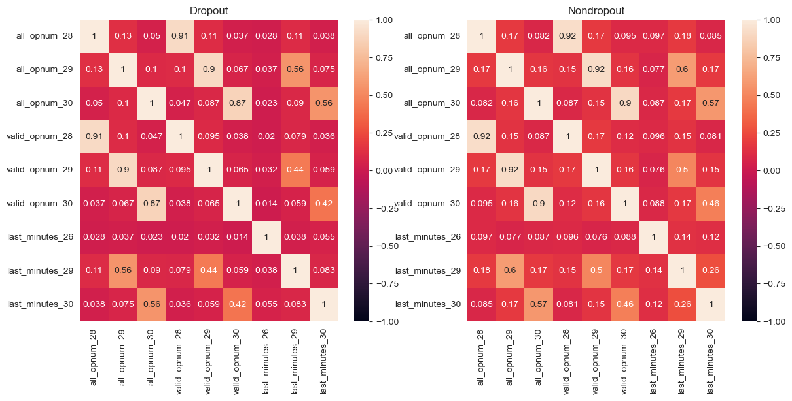
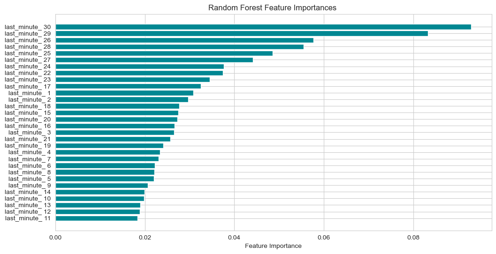
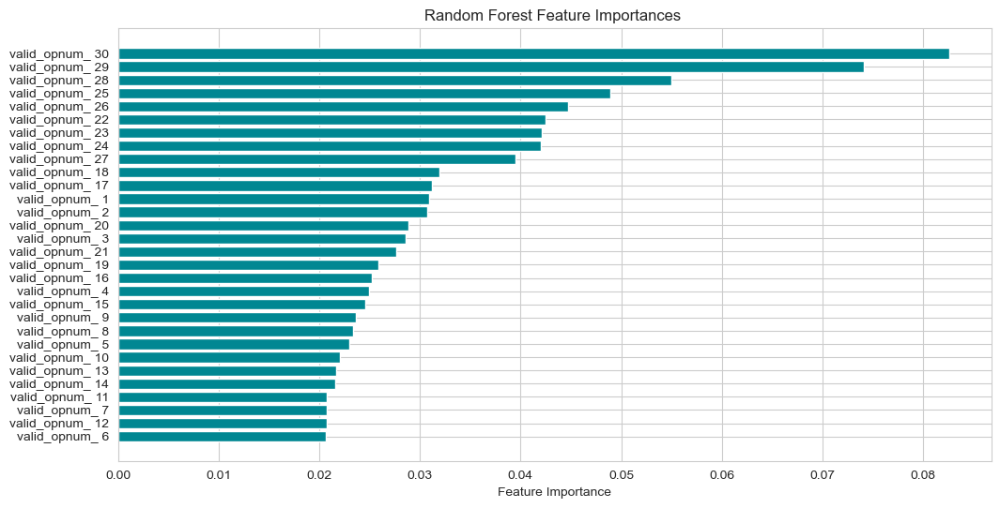
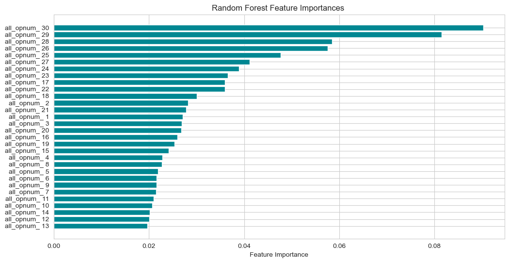
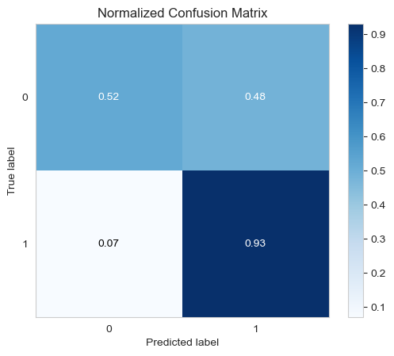
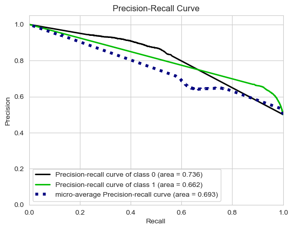

```python

import numpy as np   ###用于数值计算
import pandas as pd  ###用于数据处理和分析
import matplotlib.pyplot as plt   ###用于绘图
import matplotlib.gridspec as gridspec   ###用于更复杂的子图布局
###Jupyter Notebook中的魔法命令，用于在Notebook中内嵌绘图
%matplotlib inline   
import seaborn as sns   ###基于matplotlib的绘图库，用于制作统计图形
sns.set_style('whitegrid')  ##'whitegrid' 是其中一个可用的样式选项，它会在绘图区域后面添加一个白色的网格背景
##设置Seaborn的绘图风格为带有白色网格的背景
import datetime  ###用于日期和时间处理
import warnings  ###导入警告模块
warnings.filterwarnings('ignore')   ###忽略所有的警告信息

data = pd.read_csv('final_feature_all.csv')  ###使用pandas的read_csv函数读取名为final_feature_all.csv的CSV文件，并将数据存储在DataFrame对象data中
data.head(10)   ###使用DataFrame的head方法查看数据的前10行
```


<div>
<style scoped>
    .dataframe tbody tr th:only-of-type {
        vertical-align: middle;
    }

    .dataframe tbody tr th {
        vertical-align: top;
    }

    .dataframe thead th {
        text-align: right;
    }
</style>
<table border="1" class="dataframe">
  <thead>
    <tr style="text-align: right;">
      <th></th>
      <th>enrollment_id</th>
      <th>all_opnum_1</th>
      <th>all_opnum_2</th>
      <th>all_opnum_3</th>
      <th>all_opnum_4</th>
      <th>all_opnum_5</th>
      <th>all_opnum_6</th>
      <th>all_opnum_7</th>
      <th>all_opnum_8</th>
      <th>all_opnum_9</th>
      <th>...</th>
      <th>thirty_day_max</th>
      <th>thirty_day_sum</th>
      <th>thirty_day_mean</th>
      <th>thirty_day_std</th>
      <th>username</th>
      <th>course_id</th>
      <th>course_num</th>
      <th>nondropout_num</th>
      <th>nondrop_precent</th>
      <th>dropout</th>
    </tr>
  </thead>
  <tbody>
    <tr>
      <th>0</th>
      <td>1</td>
      <td>0</td>
      <td>0</td>
      <td>13</td>
      <td>0</td>
      <td>0</td>
      <td>0</td>
      <td>0</td>
      <td>24</td>
      <td>0</td>
      <td>...</td>
      <td>67</td>
      <td>314</td>
      <td>10</td>
      <td>18.70</td>
      <td>0</td>
      <td>28</td>
      <td>6</td>
      <td>4.0</td>
      <td>0.666667</td>
      <td>0</td>
    </tr>
    <tr>
      <th>1</th>
      <td>3</td>
      <td>28</td>
      <td>0</td>
      <td>0</td>
      <td>0</td>
      <td>3</td>
      <td>0</td>
      <td>0</td>
      <td>30</td>
      <td>0</td>
      <td>...</td>
      <td>64</td>
      <td>288</td>
      <td>9</td>
      <td>18.36</td>
      <td>1</td>
      <td>9</td>
      <td>3</td>
      <td>3.0</td>
      <td>1.000000</td>
      <td>0</td>
    </tr>
    <tr>
      <th>2</th>
      <td>4</td>
      <td>0</td>
      <td>0</td>
      <td>0</td>
      <td>20</td>
      <td>11</td>
      <td>0</td>
      <td>0</td>
      <td>0</td>
      <td>0</td>
      <td>...</td>
      <td>20</td>
      <td>99</td>
      <td>3</td>
      <td>5.89</td>
      <td>2</td>
      <td>28</td>
      <td>2</td>
      <td>1.0</td>
      <td>0.500000</td>
      <td>0</td>
    </tr>
    <tr>
      <th>3</th>
      <td>5</td>
      <td>2</td>
      <td>0</td>
      <td>145</td>
      <td>0</td>
      <td>0</td>
      <td>0</td>
      <td>0</td>
      <td>0</td>
      <td>0</td>
      <td>...</td>
      <td>145</td>
      <td>633</td>
      <td>21</td>
      <td>40.73</td>
      <td>3</td>
      <td>9</td>
      <td>1</td>
      <td>1.0</td>
      <td>1.000000</td>
      <td>0</td>
    </tr>
    <tr>
      <th>4</th>
      <td>6</td>
      <td>0</td>
      <td>0</td>
      <td>0</td>
      <td>0</td>
      <td>0</td>
      <td>0</td>
      <td>0</td>
      <td>0</td>
      <td>0</td>
      <td>...</td>
      <td>17</td>
      <td>23</td>
      <td>0</td>
      <td>3.20</td>
      <td>4</td>
      <td>22</td>
      <td>1</td>
      <td>1.0</td>
      <td>1.000000</td>
      <td>0</td>
    </tr>
    <tr>
      <th>5</th>
      <td>7</td>
      <td>20</td>
      <td>0</td>
      <td>125</td>
      <td>0</td>
      <td>0</td>
      <td>0</td>
      <td>0</td>
      <td>0</td>
      <td>0</td>
      <td>...</td>
      <td>125</td>
      <td>479</td>
      <td>15</td>
      <td>31.32</td>
      <td>5</td>
      <td>9</td>
      <td>4</td>
      <td>0.0</td>
      <td>0.000000</td>
      <td>1</td>
    </tr>
    <tr>
      <th>6</th>
      <td>9</td>
      <td>0</td>
      <td>0</td>
      <td>0</td>
      <td>0</td>
      <td>0</td>
      <td>0</td>
      <td>0</td>
      <td>0</td>
      <td>0</td>
      <td>...</td>
      <td>28</td>
      <td>97</td>
      <td>3</td>
      <td>7.42</td>
      <td>6</td>
      <td>28</td>
      <td>2</td>
      <td>1.0</td>
      <td>0.500000</td>
      <td>1</td>
    </tr>
    <tr>
      <th>7</th>
      <td>12</td>
      <td>0</td>
      <td>0</td>
      <td>0</td>
      <td>0</td>
      <td>0</td>
      <td>0</td>
      <td>0</td>
      <td>0</td>
      <td>0</td>
      <td>...</td>
      <td>22</td>
      <td>127</td>
      <td>4</td>
      <td>6.79</td>
      <td>7</td>
      <td>28</td>
      <td>1</td>
      <td>1.0</td>
      <td>1.000000</td>
      <td>0</td>
    </tr>
    <tr>
      <th>8</th>
      <td>13</td>
      <td>0</td>
      <td>0</td>
      <td>0</td>
      <td>9</td>
      <td>0</td>
      <td>34</td>
      <td>0</td>
      <td>0</td>
      <td>0</td>
      <td>...</td>
      <td>173</td>
      <td>463</td>
      <td>15</td>
      <td>35.76</td>
      <td>8</td>
      <td>4</td>
      <td>3</td>
      <td>3.0</td>
      <td>1.000000</td>
      <td>0</td>
    </tr>
    <tr>
      <th>9</th>
      <td>14</td>
      <td>0</td>
      <td>0</td>
      <td>0</td>
      <td>0</td>
      <td>0</td>
      <td>0</td>
      <td>0</td>
      <td>0</td>
      <td>0</td>
      <td>...</td>
      <td>23</td>
      <td>102</td>
      <td>3</td>
      <td>6.39</td>
      <td>9</td>
      <td>28</td>
      <td>1</td>
      <td>0.0</td>
      <td>0.000000</td>
      <td>1</td>
    </tr>
  </tbody>
</table>
<p>10 rows × 117 columns</p>
</div>


```python
#剔除不明显特征
#删除'all_opnum_1','all_opnum_4','all_opnum_7','all_opnum_10','all_opnum_11','all_opnum_13','all_opnum_14','all_opnum_15','all_opnum_16','all_opnum_17','all_opnum_18','all_opnum_19','all_opnum_20','all_opnum_23','all_opnum_25','all_opnum_26','all_opnum_27','all_opnum_28','all_opnum_29','all_opnum_30'
#data_new = data.drop(['all_opnum_1','all_opnum_2','all_opnum_3','all_opnum_4','all_opnum_5','all_opnum_6','all_opnum_7','all_opnum_8','all_opnum_9','all_opnum_10','all_opnum_11','all_opnum_12','all_opnum_13','all_opnum_14','all_opnum_15','all_opnum_16','all_opnum_17','all_opnum_18','all_opnum_19','all_opnum_20','all_opnum_21','all_opnum_22','all_opnum_23','all_opnum_24','all_opnum_25','all_opnum_26','all_opnum_27','all_opnum_28','all_opnum_29','all_opnum_30'], axis=1)
#删除'valid_opnum_1','valid_opnum_2','valid_opnum_4','valid_opnum_5','valid_opnum_7','valid_opnum_10','valid_opnum_14','valid_opnum_15','valid_opnum_16','valid_opnum_23','valid_opnum_18','valid_opnum_19','valid_opnum_21','valid_opnum_23',,'valid_opnum_25','valid_opnum_26','valid_opnum_27','valid_opnum_29'
#data_new=data_new.drop(['valid_opnum_1','valid_opnum_2','valid_opnum_3','valid_opnum_4','valid_opnum_5','valid_opnum_6','valid_opnum_7','valid_opnum_8','valid_opnum_9','valid_opnum_10','valid_opnum_11','valid_opnum_12','valid_opnum_13','valid_opnum_14','valid_opnum_15','valid_opnum_16','valid_opnum_17','valid_opnum_18','valid_opnum_19','valid_opnum_20','valid_opnum_21','valid_opnum_22','valid_opnum_23','valid_opnum_24','valid_opnum_25','valid_opnum_26','valid_opnum_27','valid_opnum_28','valid_opnum_29','valid_opnum_30'],axis=1)
data_new=data.drop(['valid_opnum_1','valid_opnum_2','valid_opnum_3','valid_opnum_4','valid_opnum_5','valid_opnum_6','valid_opnum_7','valid_opnum_8','valid_opnum_9','valid_opnum_10','valid_opnum_11','valid_opnum_12','valid_opnum_13','valid_opnum_14','valid_opnum_15','valid_opnum_16','valid_opnum_17','valid_opnum_18','valid_opnum_19','valid_opnum_20','valid_opnum_21','valid_opnum_22','valid_opnum_23','valid_opnum_24','valid_opnum_25','valid_opnum_26','valid_opnum_27','valid_opnum_28','valid_opnum_29','valid_opnum_30'],axis=1)
#last_minutes_暂时全部删除
data_new=data_new.drop(['last_minutes_1','last_minutes_2','last_minutes_3','last_minutes_4','last_minutes_5','last_minutes_6','last_minutes_7','last_minutes_8','last_minutes_9','last_minutes_10','last_minutes_11','last_minutes_12','last_minutes_13','last_minutes_14','last_minutes_15','last_minutes_16','last_minutes_17','last_minutes_18','last_minutes_19','last_minutes_20','last_minutes_21','last_minutes_22','last_minutes_23','last_minutes_24','last_minutes_25','last_minutes_26','last_minutes_27','last_minutes_28','last_minutes_29','last_minutes_30'],axis=1)
#其他待研究
data_new=data_new.drop(['pre_min','pre_max','pre_sum','pre_mean','pre_std','mid_min','mid_max','mid_sum','mid_mean','mid_std','last_min','last_max','last_sum','last_mean','last_std','thirty_day_min','thirty_day_max','thirty_day_sum','thirty_day_mean','thirty_day_std'],axis=1)
#其他关联性本身就强的不做研究
data_new=data_new.drop(['enrollment_id','username','course_id','course_num','nondropout_num','nondropout_num','nondrop_precent'],axis=1)
data_new.shape

```


    (120542, 31)


```python
#根据随机森林选择前三个特征

#30,29,28,26,25
data_new = data.drop(['all_opnum_1','all_opnum_2','all_opnum_3','all_opnum_4','all_opnum_5','all_opnum_6','all_opnum_7','all_opnum_8','all_opnum_9','all_opnum_10','all_opnum_11','all_opnum_12','all_opnum_13','all_opnum_14','all_opnum_15','all_opnum_16','all_opnum_17','all_opnum_18','all_opnum_19','all_opnum_20','all_opnum_21','all_opnum_22','all_opnum_23','all_opnum_24','all_opnum_25','all_opnum_26','all_opnum_27'], axis=1)
#30,29,28,25,26
data_new=data_new.drop(['valid_opnum_1','valid_opnum_2','valid_opnum_3','valid_opnum_4','valid_opnum_5','valid_opnum_6','valid_opnum_7','valid_opnum_8','valid_opnum_9','valid_opnum_10','valid_opnum_11','valid_opnum_12','valid_opnum_13','valid_opnum_14','valid_opnum_15','valid_opnum_16','valid_opnum_17','valid_opnum_18','valid_opnum_19','valid_opnum_20','valid_opnum_21','valid_opnum_22','valid_opnum_23','valid_opnum_24','valid_opnum_25','valid_opnum_26','valid_opnum_27',],axis=1)
#30,29,26,28,25
data_new=data_new.drop(['last_minutes_1','last_minutes_2','last_minutes_3','last_minutes_4','last_minutes_5','last_minutes_6','last_minutes_7','last_minutes_8','last_minutes_9','last_minutes_10','last_minutes_11','last_minutes_12','last_minutes_13','last_minutes_14','last_minutes_15','last_minutes_16','last_minutes_17','last_minutes_18','last_minutes_19','last_minutes_20','last_minutes_21','last_minutes_22','last_minutes_23','last_minutes_24','last_minutes_25','last_minutes_27','last_minutes_28',],axis=1)
#其他待研究18,15,13,19,20
data_new=data_new.drop(['pre_min','pre_max','pre_sum','pre_mean','pre_std','mid_min','mid_max','mid_sum','mid_mean','mid_std','last_min','last_max','last_sum','last_mean','last_std','thirty_day_min','thirty_day_max','thirty_day_sum','thirty_day_mean','thirty_day_std'],axis=1)
#其他关联性本身就强的不做研究
data_new=data_new.drop(['enrollment_id','username','course_id','course_num','nondropout_num','nondropout_num','nondrop_precent'],axis=1)
data_new.shape
data_new.head(10)
```


<div>
<style scoped>
    .dataframe tbody tr th:only-of-type {
        vertical-align: middle;
    }

    .dataframe tbody tr th {
        vertical-align: top;
    }

    .dataframe thead th {
        text-align: right;
    }
</style>
<table border="1" class="dataframe">
  <thead>
    <tr style="text-align: right;">
      <th></th>
      <th>all_opnum_28</th>
      <th>all_opnum_29</th>
      <th>all_opnum_30</th>
      <th>valid_opnum_28</th>
      <th>valid_opnum_29</th>
      <th>valid_opnum_30</th>
      <th>last_minutes_26</th>
      <th>last_minutes_29</th>
      <th>last_minutes_30</th>
      <th>dropout</th>
    </tr>
  </thead>
  <tbody>
    <tr>
      <th>0</th>
      <td>0</td>
      <td>4</td>
      <td>47</td>
      <td>0</td>
      <td>0</td>
      <td>25</td>
      <td>0.000000</td>
      <td>15.283333</td>
      <td>79.966667</td>
      <td>0</td>
    </tr>
    <tr>
      <th>1</th>
      <td>0</td>
      <td>57</td>
      <td>0</td>
      <td>0</td>
      <td>38</td>
      <td>0</td>
      <td>0.000000</td>
      <td>6.466667</td>
      <td>0.000000</td>
      <td>0</td>
    </tr>
    <tr>
      <th>2</th>
      <td>0</td>
      <td>0</td>
      <td>0</td>
      <td>0</td>
      <td>0</td>
      <td>0</td>
      <td>0.000000</td>
      <td>0.000000</td>
      <td>0.000000</td>
      <td>0</td>
    </tr>
    <tr>
      <th>3</th>
      <td>0</td>
      <td>0</td>
      <td>46</td>
      <td>0</td>
      <td>0</td>
      <td>17</td>
      <td>0.000000</td>
      <td>0.000000</td>
      <td>1106.900000</td>
      <td>0</td>
    </tr>
    <tr>
      <th>4</th>
      <td>6</td>
      <td>17</td>
      <td>0</td>
      <td>1</td>
      <td>3</td>
      <td>0</td>
      <td>0.000000</td>
      <td>82.883333</td>
      <td>0.000000</td>
      <td>0</td>
    </tr>
    <tr>
      <th>5</th>
      <td>0</td>
      <td>0</td>
      <td>0</td>
      <td>0</td>
      <td>0</td>
      <td>0</td>
      <td>0.000000</td>
      <td>0.000000</td>
      <td>0.000000</td>
      <td>1</td>
    </tr>
    <tr>
      <th>6</th>
      <td>0</td>
      <td>0</td>
      <td>0</td>
      <td>0</td>
      <td>0</td>
      <td>0</td>
      <td>1397.650000</td>
      <td>0.000000</td>
      <td>0.000000</td>
      <td>1</td>
    </tr>
    <tr>
      <th>7</th>
      <td>0</td>
      <td>0</td>
      <td>20</td>
      <td>0</td>
      <td>0</td>
      <td>6</td>
      <td>2.933333</td>
      <td>0.000000</td>
      <td>62.716667</td>
      <td>0</td>
    </tr>
    <tr>
      <th>8</th>
      <td>0</td>
      <td>0</td>
      <td>0</td>
      <td>0</td>
      <td>0</td>
      <td>0</td>
      <td>334.483333</td>
      <td>0.000000</td>
      <td>0.000000</td>
      <td>0</td>
    </tr>
    <tr>
      <th>9</th>
      <td>0</td>
      <td>0</td>
      <td>0</td>
      <td>0</td>
      <td>0</td>
      <td>0</td>
      <td>0.000000</td>
      <td>0.000000</td>
      <td>0.000000</td>
      <td>1</td>
    </tr>
  </tbody>
</table>
</div>


```python
#查看9个各特征相关性 特征间关系
dropout_data_new = data_new[data_new['dropout']==1]
nondropout_data_new = data_new[data_new['dropout']==0]

f, [ax1, ax2] = plt.subplots(1,2,figsize=(14,6)) ###1,2表示1行2列的子图布局，figsize=(14,6)设置了整个图形窗口的尺寸。
sns.heatmap(dropout_data_new.drop('dropout', 1).corr(), ax=ax1, vmin=-1, vmax=1,annot=True)##annot=True表示显示系数
ax1.set_title('Dropout')
sns.heatmap(nondropout_data_new.drop('dropout', 1).corr(), ax=ax2, vmin=-1, vmax=1,annot=True)
ax2.set_title('Nondropout')
```


    Text(0.5, 1.0, 'Nondropout')


    

    


```python
###观察颜色等级、比较颜色深浅、分析数据密度、寻找规律
```


```python
X = data_new.drop(['dropout'], axis = 'columns')###从 tr_data 中删除名为 'dropout' 的列。参数 axis = 'columns' 指定了操作是沿着列方向进行的（而不是行方向）
Label_Data = data_new['dropout']
Label_Data.head(10)
# feature_names = data_new.columns.tolist()
```


    0    0
    1    0
    2    0
    3    0
    4    0
    5    1
    6    1
    7    0
    8    0
    9    1
    Name: dropout, dtype: int64


```python
# Generate and plot imbalanced classification dataset
###生成并可视化一个不平衡分类数据集
from collections import Counter
from matplotlib import pyplot
from numpy import where
# summarize class distribution
counter = Counter(data_new['dropout'])###Counter对象来统计data_new1['dropout']列中每个唯一标签的出现次数
print(counter)
# scatter plot of examples by class label
for label, _ in counter.items():###遍历counter对象中的每个项
	row_ix = where(data_new['dropout'] == label)[0]
```

    Counter({1: 95581, 0: 24961})
    


```python
###上采样来平衡不均衡数据
# transform the dataset
from imblearn.over_sampling import SMOTE###SMOTE是一种过采样技术，用于生成少数类样本，从而平衡数据集中的类别分布
oversample = SMOTE()
###fit_resample方法首先拟合数据（即计算必要的统计信息），然后对数据进行过采样。
###X是特征数据，tr_data['dropout']是标签数据。
###过采样后，得到的平衡数据集被存储在X_r（重新采样的特征数据）和y（重新采样的标签数据）中
X_r, y = oversample.fit_resample(X, data_new['dropout'])
# summarize the new class distribution
counter = Counter(y)
print(counter)
# scatter plot of examples by class label
for label, _ in counter.items():
	row_ix = where(y == label)[0]

from sklearn.preprocessing import StandardScaler
## Standardizing the data  数据标准化
X_r2 = StandardScaler().fit_transform(X_r)
```

    Counter({0: 95581, 1: 95581})
    


```python
from sklearn.model_selection import train_test_split  
X_train,X_test,y_train,y_test = train_test_split(X_r2, y, test_size=0.3)
X_train.shape,y_train.shape 

```


    ((133813, 9), (133813,))


```python
X_test.shape,y_test.shape 
```


    ((57349, 9), (57349,))


```python

from sklearn.linear_model import LogisticRegression
import xgboost as xgb
#新看到的lgb算法，比xgb更快，精度差不多，引入尝试效果
import lightgbm as lgb
from sklearn.ensemble import RandomForestClassifier, VotingClassifier

from sklearn.metrics import confusion_matrix#导入库ConfusionMatrixDisplay
##from sklearn.metrics import plot_confusion_matrix##scikit-learn1.2以上不能用
from sklearn.metrics import  ConfusionMatrixDisplay#导入库ConfusionMatrixDisplay
from sklearn.metrics import roc_curve  
import matplotlib.pyplot as plt
from sklearn import metrics  
from sklearn.metrics import precision_score, recall_score, f1_score  
```


```python
# #last_minute给图换个颜色
# #3.2.4 RandomForest
# rf = RandomForestClassifier(n_jobs = -1,
#                             random_state = 1)

# # rf.fit(X_train_rus, y_train_rus)
# rf.fit(X_train, y_train)
# y_pred = rf.predict(X_test)
# y_score = rf.predict_proba(X_test)[:,1]

  
# # 获取特征重要性  
# importances = rf.feature_importances_  
  
# # 创建特征名列表，使用索引作为名称  
# features = ['last_minute_ {}'.format(i+1) for i in range(X_train.shape[1])]  
  
# # 对特征重要性进行排序，并获取对应的特征名（升序）  
# sorted_indices = np.argsort(importances)  
# sorted_features = [features[i] for i in sorted_indices]  
# sorted_importance_values = importances[sorted_indices]  
  
# # 绘制特征重要性图  
# plt.figure(figsize=(12, 6))  
# plt.barh(range(len(sorted_features)), sorted_importance_values, align='center', color='#008792')  
# plt.yticks(range(len(sorted_features)), sorted_features)  # 设置Y轴刻度标签  
# plt.xlabel('Feature Importance')  
# plt.title('Random Forest Feature Importances ')  
# plt.show()
```


    

    


```python
# #valid_opnum给图换个颜色
# #3.2.4 RandomForest
# rf = RandomForestClassifier(n_jobs = -1,
#                             random_state = 1)

# # rf.fit(X_train_rus, y_train_rus)
# rf.fit(X_train, y_train)
# y_pred = rf.predict(X_test)
# y_score = rf.predict_proba(X_test)[:,1]

  
# # 获取特征重要性  
# importances = rf.feature_importances_  
  
# # 创建特征名列表，使用索引作为名称  
# features = ['valid_opnum_ {}'.format(i+1) for i in range(X_train.shape[1])]  
  
# # 对特征重要性进行排序，并获取对应的特征名（升序）  
# sorted_indices = np.argsort(importances)  
# sorted_features = [features[i] for i in sorted_indices]  
# sorted_importance_values = importances[sorted_indices]  
  
# # 绘制特征重要性图  
# plt.figure(figsize=(12, 6))  
# plt.barh(range(len(sorted_features)), sorted_importance_values, align='center', color='#008792')  
# plt.yticks(range(len(sorted_features)), sorted_features)  # 设置Y轴刻度标签  
# plt.xlabel('Feature Importance')  
# plt.title('Random Forest Feature Importances ')  
# plt.show()
```


    

    


```python
# #all_opnum给图换个颜色
# #3.2.4 RandomForest
# rf = RandomForestClassifier(n_jobs = -1,
#                             random_state = 1)

# # rf.fit(X_train_rus, y_train_rus)
# rf.fit(X_train, y_train)
# y_pred = rf.predict(X_test)
# y_score = rf.predict_proba(X_test)[:,1]

  
# # 获取特征重要性  
# importances = rf.feature_importances_  
  
# # 创建特征名列表，使用索引作为名称  
# features = ['all_opnum_ {}'.format(i+1) for i in range(X_train.shape[1])]  
  
# # 对特征重要性进行排序，并获取对应的特征名（升序）  
# sorted_indices = np.argsort(importances)  
# sorted_features = [features[i] for i in sorted_indices]  
# sorted_importance_values = importances[sorted_indices]  
  
# # 绘制特征重要性图  
# plt.figure(figsize=(12, 6))  
# plt.barh(range(len(sorted_features)), sorted_importance_values, align='center', color='#008792')  
# plt.yticks(range(len(sorted_features)), sorted_features)  # 设置Y轴刻度标签  
# plt.xlabel('Feature Importance')  
# plt.title('Random Forest Feature Importances ')  
# plt.show()
```


    

    


```python

```


```python

```


```python
#快速展示模型预测结果和标签计算得到的混淆矩阵
#筛选出的9个特征
import scikitplot as skplt
rf = RandomForestClassifier()
rf = rf.fit(X_train, y_train)
y_pred = rf.predict(X_test)

skplt.metrics.plot_confusion_matrix(y_test, y_pred, normalize = True)
plt.show()

```


    

    


```python
# #从标签和概率生成PR曲线
# #筛选出的9个特征
# import scikitplot as skplt
# from sklearn.naive_bayes import GaussianNB
# import scikitplot as skplt
# nb = GaussianNB()
# nb.fit(X_train, y_train)
# y_probas = nb.predict_proba(X_test)

# skplt.metrics.plot_precision_recall(y_test, y_probas)
# plt.show()


```


    

    


```python

```
